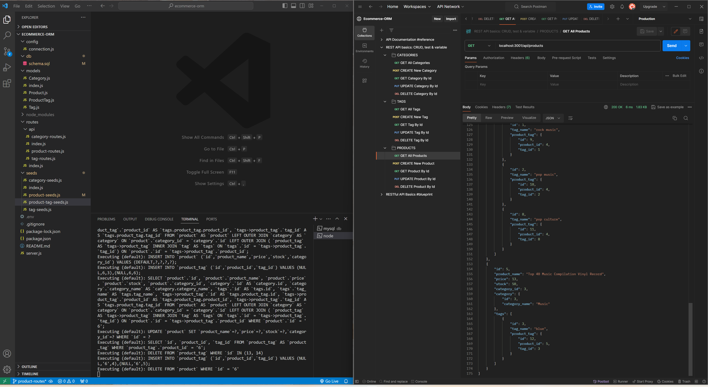

[](https://expressjs.com/) [](https://nodejs.org/en) [](https://www.npmjs.com/)
[](https://www.mysql.com/) [](https://www.npmjs.com/package/dotenv) [](https://sequelize.org/api/v6/identifiers)


<div align="right"> 
<a href= "http://www.wtfpl.net/about/"></a>
</div>

# Ecommerce ORM   

This app lets users write and save notes with title and description.

##  Description

E-commerce websites are vital in the world of electronics industry. They facilate businesses and consumers in participating in the online transcation of electronic products. To support the ever-growing electronic industry, e-commerce platforms are being developed rapidly. So nowdays, developers' job certainly includes creating such technologies. 

This app helps to uderstand the basic architecture of e-commerce sites. However, it does not deal with front-end user interface. The primary actor of this system is a manager of an internet retail company, and the use cases are read, create, view and delete categories, tags and products. 

This app builds `Node.js` Restful CRUD `API`s using `Express`, `Sequelize` with `MySQL` database. `DotEnv` package is use to store sensitive data such as MySQL username, passwrod, database name etc.


## Table of Contents

1. [Installation](#installation)
1. [Usage](#usage)
1. [Licence](#licence)
1. [Screenshots](#screenshots)
1. [Demo](#demo)


## Installation 

1. Download the [starter code](https://github.com/coding-boot-camp/fantastic-umbrella)
         
1. Install `Node Module`
    ```
    npm i
    ```
1. Create your Project/Repo folder, and paste all the contents of `Develop` from the starter code. Delete the Develop folder.

1. Change the  `.env.EXAMPLE` file to `.env`, and  type in your `database name`, `user` and `password`
1. Before starting the development of the project, run the following in the terminal in the root directory of the project. Every time code changes, the server will automatically restart.
    ```
    npm run dev
    ```

## Usage

To use this project,
- Get a copy of this repo to your local machine.
- Install the `Node Module`
- Change the `.env copy` file to `.env` and insert your database name, user and password
- Change the directory to `db` folder, and type in the following, and followed by your password to connect to your database 
    ```
    mysql - u root -p;
  ```
- Source the `schema`
    ```
    SOURCE schema.sql;
    ```
- Then, change the directory to the root of the project, and type in the following:
    ```
    npm run seed;
    ```
- And, start the `Express Server` by typing in the following:
    ```
    npm run start
    ```
- Open the `Postman` to test the various API endpoints
    Some api endpoints are:
    - GET All Categories
        ```
        localhost:3001/api/categories/
        ```
    - GET All Tags
        ```
        localhost:3001/api/tags/
        ```
    - GET All Products
        ```
        localhost:3001/api/products/
        ```


## Licence

This app is licensed under [**WTFPL**](http://www.wtfpl.net/about/)

## Screenshots

Screenshot showing the `Get All Products` endpoint being tested in Postman         



## Demo            
https://github.com/SimpleSuyash/ecommerce-orm/assets/149545043/f43d0865-70b1-4dd8-814e-576992bca2e7


